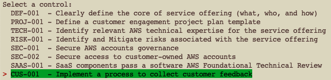
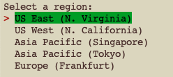
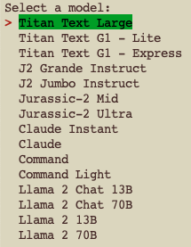
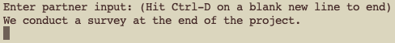
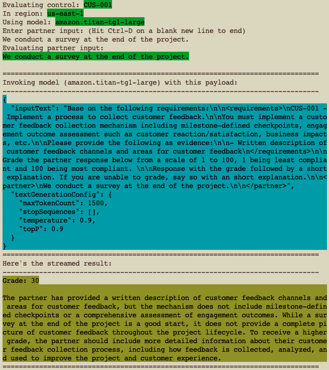

## SOFTR Evaluator powered by Amazon Bedrock!

### Configuration
This distribution is set up like a standard Python project. The initialization process uses __virtualenv__ within this project to create an isolated Python environment, stored under the `.venv` directory. To create the __virtualenv__, it assumes that there is a `python3` (or `python` for Windows) executable in your path with access to the `venv` package. 

To create a __virtualenv__ on MacOS and Linux:

```
$ python3 -m venv .venv
```

After the __virtualenv__ is created, you can use the following step to activate it:

```
$ source .venv/bin/activate
```

If you are a Windows platform, you would activate the __virtualenv__ like this:

```
% .venv\Scripts\activate.bat
```

Once the __virtualenv__ is activated, you can install the required dependencies.

```
$ pip install -r requirements.txt
```

### Run the evaluator
Once you have all the required Python dependencies installed, ensure you have the required AWS credentials to access Amazon Bedrock. (How to obtain the required AWS credentials is beyond the scope of this project.)

Check out the _optional_ commandline options of the SOFTR evaluator app:

```
$ python softr.py -h
usage: softr.py [-h] [--control CONTROL] [--region REGION] [--model-id MODEL_ID]
                [--body BODY]

options:
  -h, --help           show this help message and exit
  --control CONTROL    SOFTR control
  --region REGION      AWS Region
  --model-id MODEL_ID  The foundation model identifier
  --body BODY          (blob) Partner input
```

#### Example

```
$ python softr.py --control CUS-001 --region us-east-1 \
  --model-id amazon.titan-tg1-large \
  --body "We conduct a survey at the end of the project."
```

#### Interactive Example

If you run the app without supplying any or all of the options, you app will interactively obtain the required information from you.

##### SOFTR Control Selection



#### AWS Region Selection



#### Foundation Model Selection



#### Supply Partner Input



When finished, press __Ctrl-D__ on a blank new line to complete the partner input.

#### The Evaluation Results


